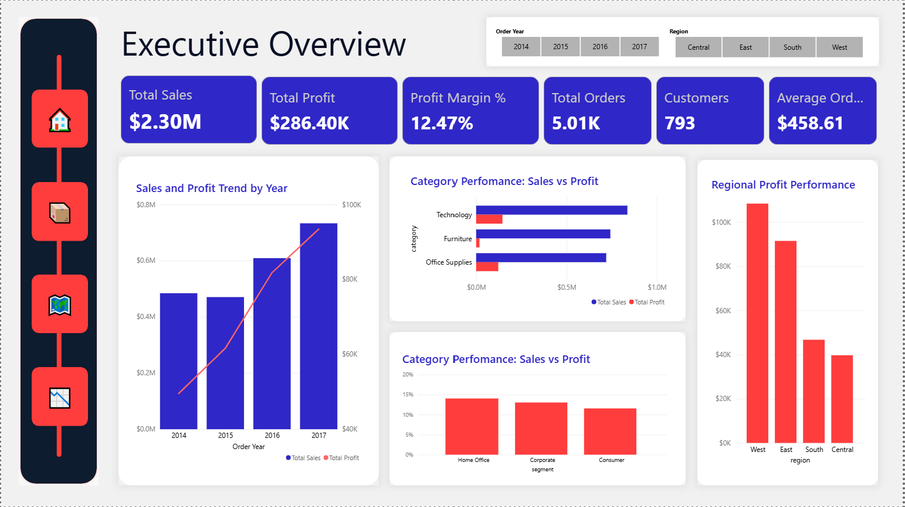
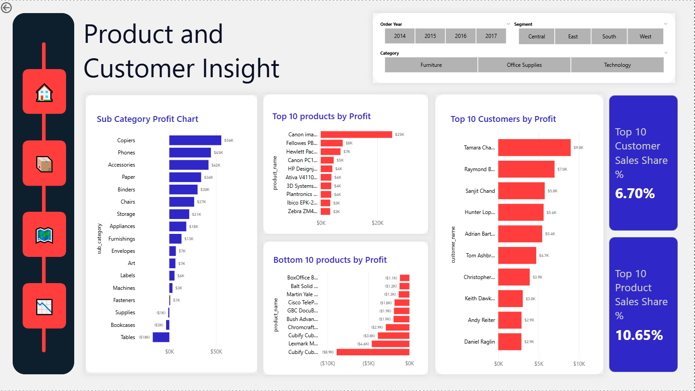
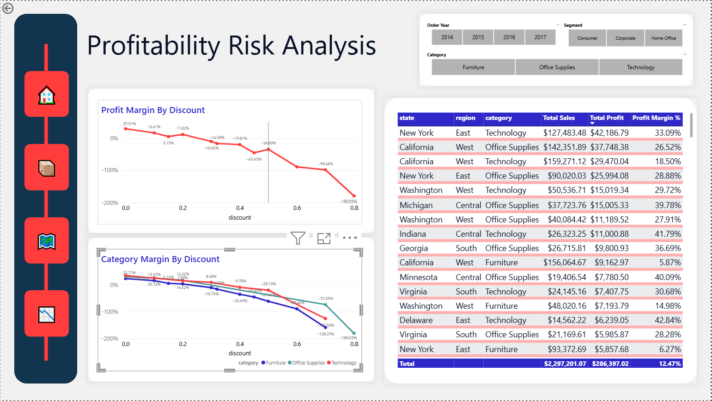

# Retail Sales Performance and Profitability Analysis using SQL and Power BI

## Project Overview

This project is a retail business analysis case study built using **MySQL** and **Power BI**. The goal was to analyse transaction level retail data and evaluate how the business performs across sales, profit, products, customers, regions, and discounting.

Rather than treating the dataset as a basic SQL exercise, the project was approached as a structured business investigation designed to uncover performance drivers, weak points, and profitability risks.

---

## Business Objective

The analysis was designed to answer key commercial questions such as:

- Is the business growing over time in both sales and profit?
- Which categories, sub categories, and products drive the most value?
- Are high sales always translating into high profit?
- Which customers are the most valuable?
- Which regions and states perform best and worst?
- How does discounting affect profitability?
- Is profit concentrated in a small number of products or customers?

---

## Dataset Summary

The dataset is structured at **transaction line level**, meaning each row represents one product line within an order rather than one complete order.

### Dataset highlights
- **9,994** transaction rows
- **5,009** distinct orders
- **793** customers
- **3** product categories
- **17** sub categories
- order dates from **2014 to 2017**

This structure was important because order based metrics had to be calculated using `COUNT(DISTINCT order_id)` rather than row counts.

---

## Tools Used

- **MySQL** for data validation, KPI analysis, trend analysis, and business investigation
- **Power BI** for dashboard design and visual storytelling
- **SQL** for structured analysis across products, customers, regions, and discount behaviour

---

## Project Workflow

The project followed this analytical process:

1. Data understanding and validation  
2. KPI and overall business performance analysis  
3. Sales and profit trend analysis  
4. Product and category analysis  
5. Customer and segment analysis  
6. Regional and state analysis  
7. Discount and profitability analysis  
8. Concentration risk analysis  
9. Dashboard development in Power BI  

---

## Key Findings

- The business generated **2.30M** in sales and **286.4K** in profit, with an overall profit margin of **12.47%**
- Growth was positive overall, but sales and profit did not always move together in the same way
- **Technology** and **Office Supplies** are strong categories, while **Furniture** is structurally weak
- **Tables** and **Bookcases** are major loss making sub categories
- High sales do not always mean high value. Some top revenue products and customers are loss making
- Profit is more concentrated than sales across both products and customers
- Geographic performance is uneven, with **California** and **New York** acting as strong value centres, while **Texas**, **Ohio**, **Pennsylvania**, and **Illinois** are major profit drains
- Profitability declines sharply as discounts rise and turns negative from around **30% discount** onward
- **Furniture** is the most discount sensitive category
- The worst losses are concentrated in specific category-state combinations such as **Texas Office Supplies** and **Ohio Technology**

---

## Dashboard Preview

### Executive Overview


### Product and Customer Insights


### Profitability Risk and Geography


---

## Repository Structure
```text
retail-sales-profitability-analysis-sql-powerbi/
│
├── sql/
│   └── retail_analysis.sql
│
├── dashboard/
│   └── retail_dashboard.pbix
│
├── visuals/
│   ├── executive_overview.png
│   ├── product_customer_insights.png
│   └── profitability_risk_geography.png
│
├── report/
│   └── retail_analysis_report.md
│
└── README.md
```
---

## Dashboard Preview
How to Use This Repository
Review the SQL analysis in sql/retail_analysis.sql
Explore the dashboard screenshots in the visuals/ folder
Open the .pbix file in the dashboard/ folder to interact with the Power BI dashboard
Refer to the report file for the full written case study

---

## Skills Demonstrated
- SQL querying and aggregation
- KPI analysis
- trend analysis
- product and customer profitability analysis
- discount sensitivity analysis
- regional and state performance analysis
- concentration risk analysis
- Power BI dashboard development
- business insight generation

---

## Author
Nnaemeka Sinclaire Ndubuisi
Data Analyst & Data Scientist | SQL | Power BI | Python | Machine learning
